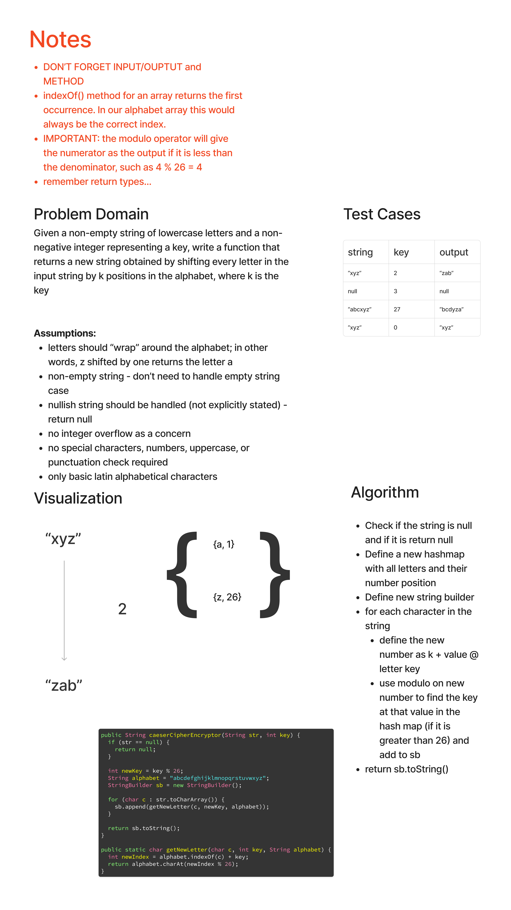

# Strings - Caesar Cipher Encryption

## Features

Given a non-empty string of lowercase letters and a non-negative integer representing a key, write a function that returns a new string obtained by shifting every letter in the input string by k positions in the alphabet, where k is the key.

Note that letters should "wrap" around the alphabet; in other words, the letter `z` shifted by one returns the letter `a`

## Whiteboard Process

Note: Whiteboard below may not be a working solution based on technical interview simulation. Code solution may differ.

## Approach & Efficiency

- The Big O time complexity for the is O(n), as we traverse the total number of characters. The space complexity is O(n), as this uses a StringBuilder with n characters in it.

## Solution

[Link to Correct Code](../../src/main/java/strings/CaesarCipherEncryption.java)

