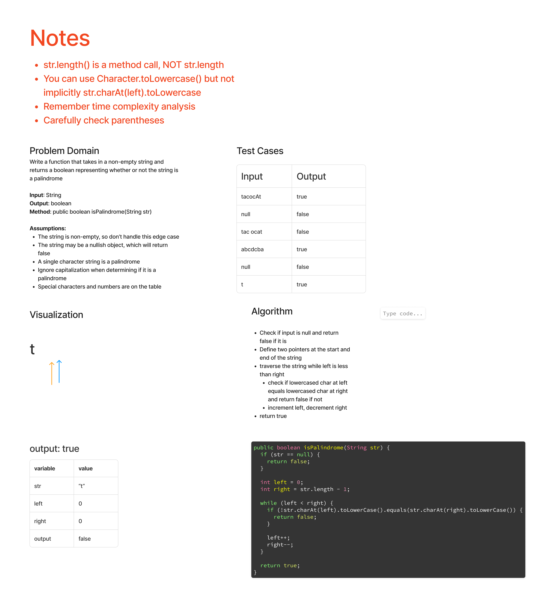

# Strings - Palindrome Check

## Features

Write the following method for the Binary Tree class

- find maximum value
    - Arguments: none
    - Returns: number

Find the maximum value stored in the tree. You can assume that the values stored in the Binary Tree will be numeric.

## Whiteboard Process

Note: Whiteboard below may not be a working solution based on technical interview simulation. Code solution may differ.

## Approach & Efficiency

- The Big O time complexity for the is O(n), as there are steps equal to half the total number of characters. The space complexity is O(1), as this solution doesn't depend on size of input.

## Solution

[Link to Correct Code](../../src/main/java/strings/PalindromeCheck.java)

